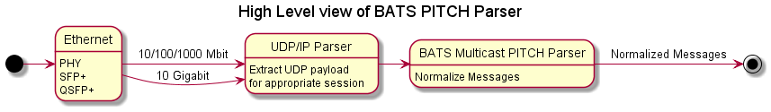
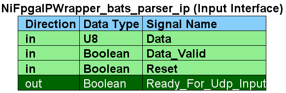
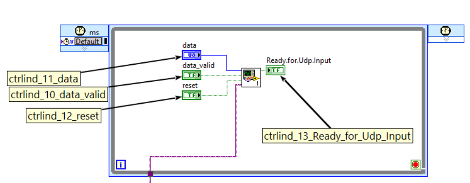
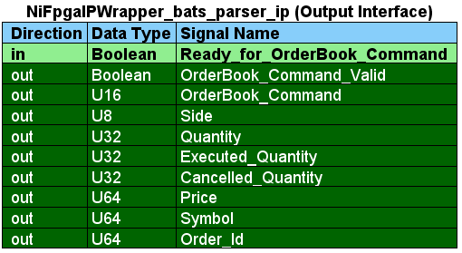
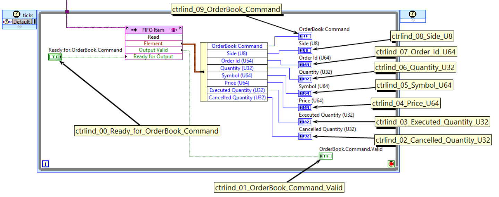

# arty_bats
Parse and Normalize BATS Multicast PITCH data using LabVIEW FPGA and the Arty Artix-7 A100T Board

# For Updated Information see:
https://fpganow.com/index.php/parse-bats-messages-in-an-fpga/

# High Level Diagram

# State Machine for BATS PITCH Parser

# Input interface for BATS Multicast PITCH Parser block

## The LabVIEW FPGA interface - just the parameters from above

## Or the equivalent Verilog interface
	ctrlind_10_data_valid : in std_logic_vector(0 downto 0);
	ctrlind_11_data : in std_logic_vector(7 downto 0);
	ctrlind_12_reset : in std_logic_vector(0 downto 0);
	ctrlind_13_Ready_for_Udp_Input : out std_logic_vector(0 downto 0);

# Output interface for BATS Multicast PITCH Parser block

## The LabVIEW FPGA interface - just the parameters from above

## Or the equivalent Verilog interface
	ctrlind_00_Ready_for_OrderBook_Command : in std_logic_vector(0 downto 0);
	ctrlind_01_OrderBook_Command_Valid : out std_logic_vector(0 downto 0);
	ctrlind_02_Cancelled_Quantity_U32 : out std_logic_vector(31 downto 0);
	ctrlind_03_Executed_Quantity_U32 : out std_logic_vector(31 downto 0);
	ctrlind_04_Price_U64 : out std_logic_vector(63 downto 0);
	ctrlind_05_Symbol_U64 : out std_logic_vector(63 downto 0);
	ctrlind_06_Quantity_U32 : out std_logic_vector(31 downto 0);
	ctrlind_07_Order_Id_U64 : out std_logic_vector(63 downto 0);
	ctrlind_08_Side_U8 : out std_logic_vector(7 downto 0);
	ctrlind_09_OrderBook_Command : out std_logic_vector(15 downto 0);

* Diagrams generated using PlantUML (http://plantuml.com)